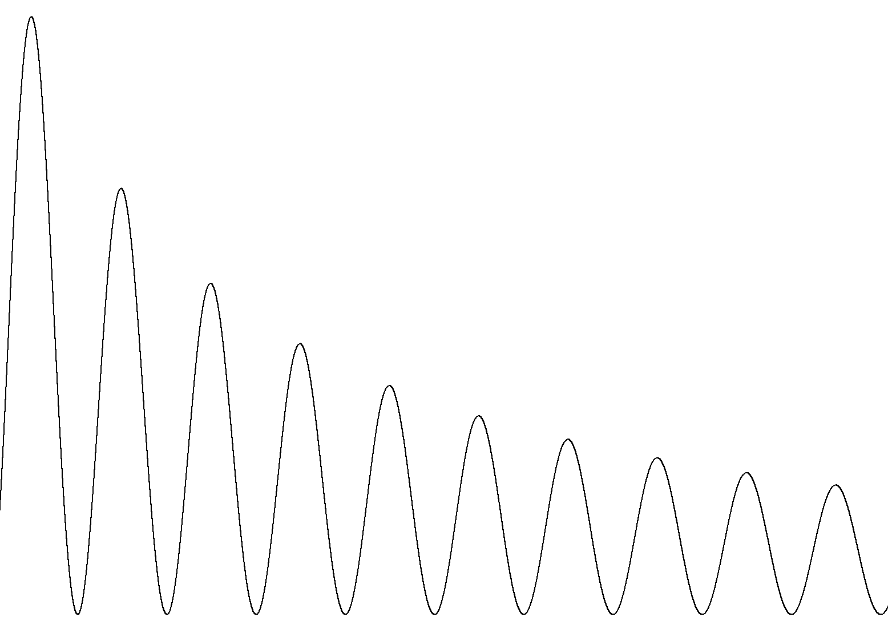

---
output:
  github_document:
    html_preview: true
---

<!-- README.md is generated from README.Rmd. Please edit that file -->


```{r, echo = FALSE}
knitr::opts_chunk$set(
  collapse = TRUE,
  comment = "#>",
  fig.path = "man/figures/README-"
)
```

# attenuation 
[](https://travis-ci.org/JonasMoss/attenuation)
[](https://ci.appveyor.com/project/JonasMoss/attenuation)
[](https://codecov.io/gh/JonasMoss/attenuation?branch=master)
[](https://www.repostatus.org/#active)
[](https://cran.r-project.org/package=attenuation)
[](https://zenodo.org/badge/latestdoi/194718529)

An `R` package for computing confidence curves, confidence intervals and *p*-values for [correlation coefficients corrected for attenuation due to measurement error](https://en.wikipedia.org/wiki/Correction_for_attenuation). The package implements the methods described in [Moss, 2019](https://arxiv.org/abs/1911.01576).


```{r setup, include=FALSE}
library("attenuation")
knitr::opts_chunk$set(echo = TRUE)
knitr::opts_chunk$set(out.width='750px', dpi=200)
```

## Installation

Run the following in `R` to install the current CRAN release of the package.

```{r install, echo = TRUE, eval = FALSE}
install.packages("attenuation")
```

Or use `devtools` to install the development version.

```{r install_devtools, echo = TRUE, eval = FALSE}
# install.packages("devtools")
devtools::install_github("JonasMoss/attenuation")
```

## Usage
Use `cc` to calculate a confidence curve and `plot` to plot it. 

```{r simpleuse, echo = TRUE, eval = TRUE}
library("attenuation")
r = c(0.20, sqrt(0.45), sqrt(0.55))
N = c(100, 100, 100)
curve = cc(r, N)
plot(curve, level = 0.90)
```

Confidence sets can be calculated with `ci`. *NB*: These sets are not 
necessarily intervals. They can be either the disjoint union of two intervals or empty.

```{R, echo = TRUE, eval = TRUE}
ci(r, N)
```

To find the *p*-value for the null hypothesis of a specific rho, use the 
`p_value` function.
```{R, echo = TRUE, eval = TRUE}
p_value(rho = 0, r, N)
```

## How to Contribute or Get Help
If you encounter a bug, have a feature request or need some help, open a [Github issue](https://github.com/JonasMoss/attenuation/issues). Create a pull requests
to contribute. This project follows a [Contributor Code of Conduct](https://www.contributor-covenant.org/version/1/4/code-of-conduct.md).

## References

* [Moss, Jonas. "Correcting for attenuation due to measurement error" (2019)](https://arxiv.org/abs/1911.01576)
